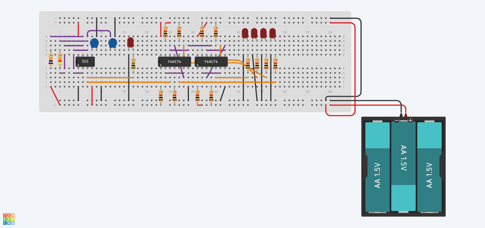
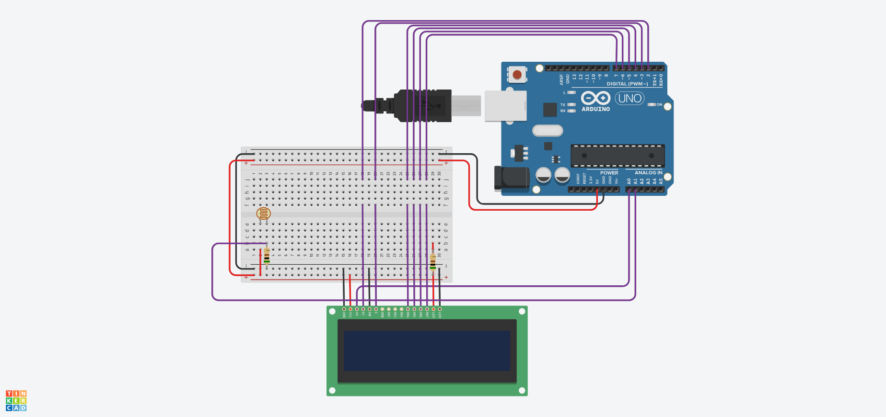
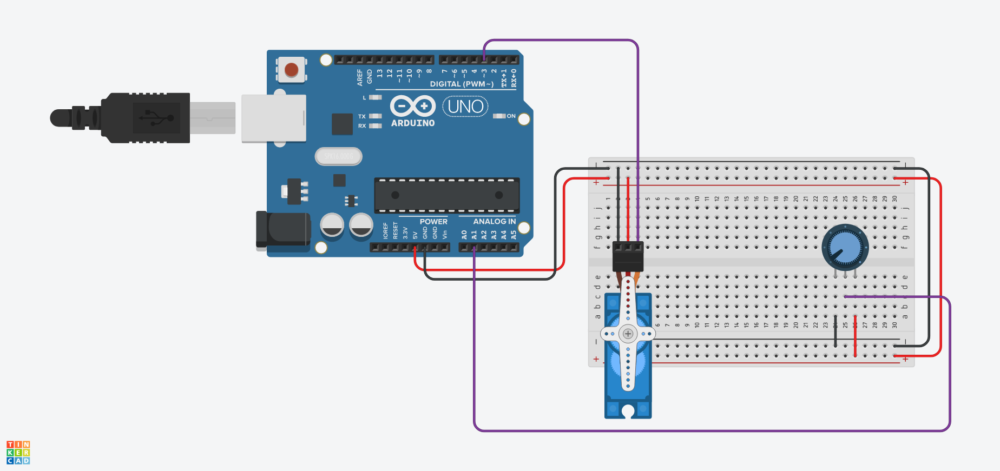

# AUV Electrical Assignment

This folder contains the submission for the elctrical task of AUV.

## Task 1

> Make an account on TinkerCad.

Created a personal account on TinkerCad.

## Task 2

> Implement a 4-bit binary counter using LEDs as well as 7 segment display.

The following circuit was inplemented on tinkercad:


The link to the circuit is https://www.tinkercad.com/things/56v2Z6cdDby-auv-electrical-task-2/.


The .brd file has been included in this folder.

## Task 3

> Us any sensor like force sensor, temperature sensor, IR, etc and display its data on the LCD screen.

The following circuit was inplemented on tinkercad:


Arduino was used. Following is the code that was used:
```
#include <LiquidCrystal.h>

LiquidCrystal lcd(2, 3, 4, 5, 6, 7);

int contrastPin = A0;
int readingPin = A1;

void setup()
{
  lcd.begin(16, 2);
  lcd.clear();
  
  pinMode(contrastPin, OUTPUT);
  pinMode(readingPin, INPUT);
  analogWrite(contrastPin, 50);
}

void loop()
{
  lcd.setCursor(0, 0);
  lcd.print("Value: ");
  lcd.print(analogRead(readingPin));
}
```

The link to circuit is https://www.tinkercad.com/things/lF16vIUWUV2-auv-electrical-task-3/.

The .brd file has been included in this folder.

## Task 4

> Control the rotation of the servomotor using Arduino.

The following circuit was implemented on tinkercad:


Arduino was used. Following is the code that was used:
```
int potPin = A1;
int servoPin = 3;

void setup()
{
  Serial.begin(9600);
  pinMode(potPin, INPUT);
  pinMode(servoPin, OUTPUT);
}

void loop()
{
  analogWrite(servoPin, analogRead(potPin)/4);
  delay(50);
}
```

THe link to the circuit is https://www.tinkercad.com/things/jeN3rh3eveg-auv-electrical-4/.

The .brd file has been included in this folder.